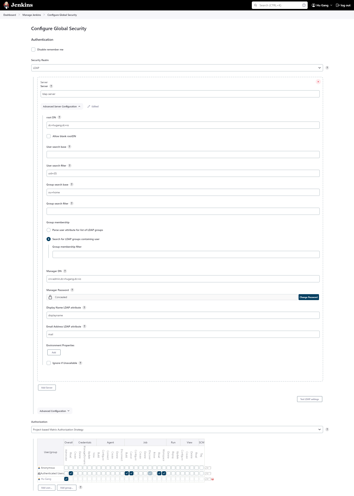

# Get the initial admin password
docker exec my-jenkins cat /var/jenkins_home/secrets/initialAdminPassword





## docker in jenkins

1. install docker in jenkins dockerfile
2. add docker-compose.yml
```yaml
    # docker-compose.yml add environment DOCKER_HOST
    environment:
      - DOCKER_HOST=tcp://192.168.0.106:2375
```
3. add tcp port in docker.service

```bash
#/usr/lib/systemd/system/docker.service
ExecStart=/usr/bin/dockerd -H fd:// -H tcp://0.0.0.0:2375 --containerd=/run/containerd/containerd.sock
```

