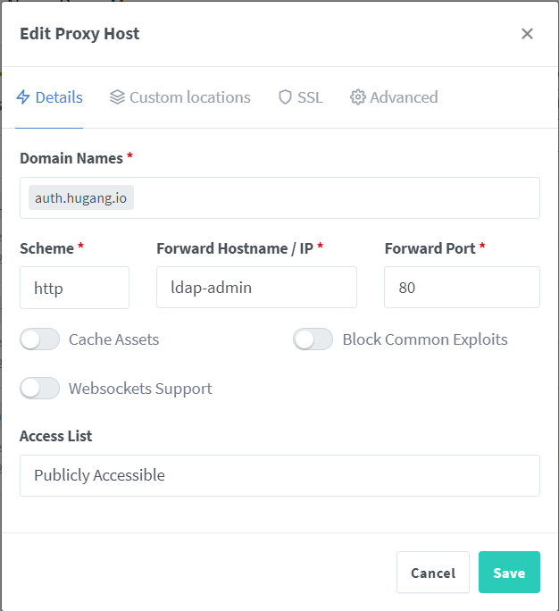
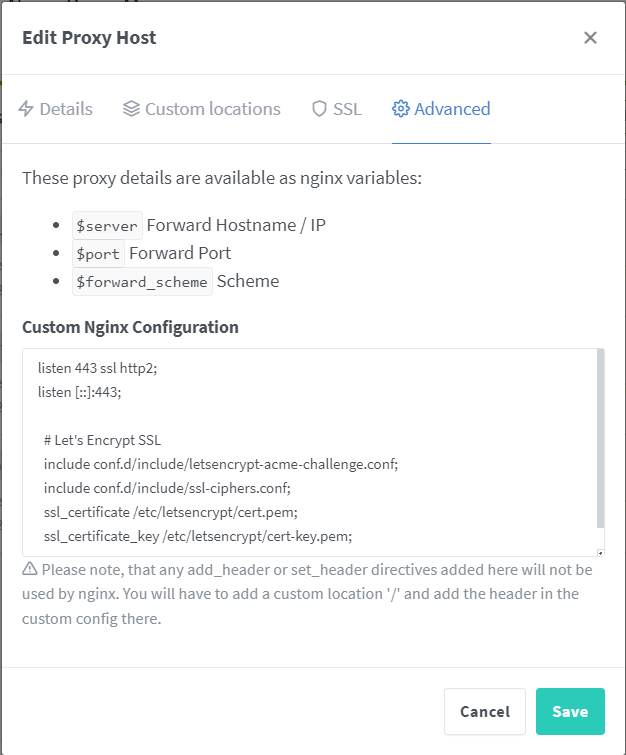

## mkcert
- cert

mkcert `https://github.com/FiloSottile/mkcert`

```
mkcert -install
mkcert auth.hugang.io file.hugang.io task.hugang.io git.hugang.io build.hugang.io chat.hugang.io memo.hugang.io hugang.io localhost 127.0.0.1 192.168.0.111
mkcert -CAROOT
```


## nginx-proxy-manager




```
listen 443 ssl http2;
listen [::]:443;

  # Let's Encrypt SSL
  include conf.d/include/letsencrypt-acme-challenge.conf;
  include conf.d/include/ssl-ciphers.conf;
  ssl_certificate /etc/letsencrypt/cert.pem;
  ssl_certificate_key /etc/letsencrypt/cert-key.pem;

```
