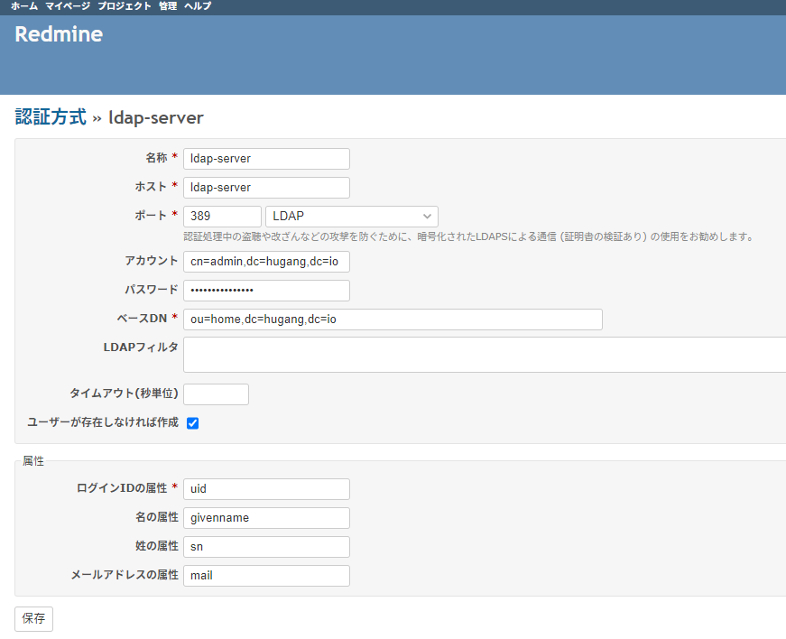

```
cd {RAILS_ROOT}/plugins
git clone https://github.com/onozaty/redmine-view-customize.git view_customize
cd ../
bundle install --without development test
bundle exec rake redmine:plugins:migrate RAILS_ENV=production
```

```
  Name     = Some random description
  Host     = <IP of the host>
  Port     = <389>
  LDAPS    = no
  Account  = < Admins DN > (cn=admin,dc=domain,dc=tld)
  Password = < Admins Pass >
  Base DN  = < Default Users DN > (cn=People,dc=domain,dc=tld)   

On-the-fly user creation = yes
Attributes
   Login     = uid
   Firstname = givenName
   Lastname  = sn
   Email     = mail
```

